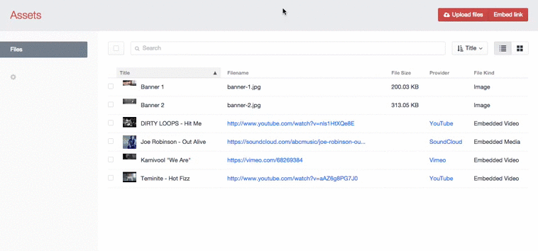
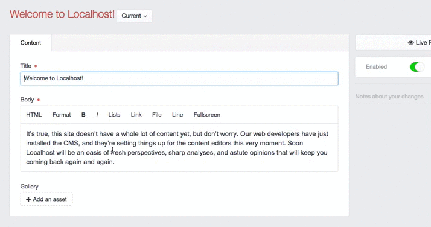

# Embedded assets for Craft 

Add embeddable media such as YouTube videos to your assets manager.

## Demo




## Installation

1. Copy the `embeddedassets` folder to your plugins directory and install the plugin through the control panel.
2. Modify your `general.php` configuration file to include the setting `'extraAllowedFileExtensions' => 'json'`. This
   needs to be done because the embedded assets are stored as JSON files, and Craft doesn't allow JSON files by default. 

And you're done!

## Template Usage

```twig

	
	
		{{ embed.safeHtml }}
	

```

As embedded assets are still normal asset files, you can access them through the `craft.assets` elements API. In order
to get the actual embed data, call the `craft.embeddedAssets.fromAsset(asset)` function where `asset` is the asset
model.

### `craft.embeddedAssets.*`

| Function             | Description                                                                                                                                             |
|----------------------|---------------------------------------------------------------------------------------------------------------------------------------------------------|
| `isEmbedded(asset)`  | Determines if an asset is an embedded asset. This method is usually not necessary as you can use the `fromAsset` method and check if it returns `null`. |
| `fromAsset(asset)`   | Returns the embedded asset model from an asset if it's an embedded asset, otherwise returns `null`.                                                     |
| `fromAssets(assets)` | Takes an array of assets and returns an array consisting of only embedded assets.                                                                       |

### `EmbeddedAssetModel`

| Parameter         | Description                                                                                            |
|-------------------|--------------------------------------------------------------------------------------------------------|
| `id`              | The ID of the asset.                                                                                   |
| `type`            | The type of media the embedded asset is. Either `photo`, `video`, `link` or `rich`.                    |
| `url`             | The URL of the media.                                                                                  |
| `title`           | The title of the media.                                                                                |
| `description`     | The description of the media.                                                                          |
| `authorName`      | The author of the media.                                                                               |
| `authorUrl`       | The URL to the author.                                                                                 |
| `providerName`    | The provider of the media.                                                                             |
| `providerUrl`     | The URL to the provider.                                                                               |
| `cacheAge`        | The recommended cache lifetime of the media, in seconds.                                               |
| `thumbnailUrl`    | The thumbnail of the media.                                                                            |
| `thumbnailWidth`  | The width of the thumbnail, in pixels.                                                                 |
| `thumbnailHeight` | The height of the thumbnail, in pixels.                                                                |
| `html`            | The embeddable HTML of the media. It is recommended not to use this parameter in favour of `safeHtml`. |
| `safeHtml`        | The embeddable HTML of the media that's been purified.                                                 |
| `width`           | The width of the media, in pixels.                                                                     |
| `height`          | The height of the media, in pixels.                                                                    |

For more information, read through the [oEmbed spec](http://oembed.com/).

## Configuration

You can configure the settings of the plugin through the control panel. Advanced configuration options are found in the
`config.php` file, which can be overridden by including a `embeddedassets.php` file in your `config` directory.

### Whitelist

This is a list of domains (separated by a new line) that will be preserved when purifying the HTML. Purified HTML is
found in the `EmbeddedAssetModel::safeHtml` parameter, and is recommended to be used over the `html` parameter. Domains
in this list will automatically include all subdomains, directories and protocols, so they do not (and should not) be
specified.

It's important to emphasise that this whitelist does not apply to links added through the modal window (all links are
welcome here). This means that you only need to consider URL's in the `html` parameter. Keep in mind some providers will
use different or multiple domains here - for example, YouTube may embed videos with the `youtube-nocookie.com` domain.

The plugin comes with this default whitelist, which should be enough for the majority of uses:

- 23hq.com
- app.net
- animoto.com
- aol.com
- collegehumor.com
- dailymotion.com
- deviantart.com
- embed.ly
- fav.me
- flic.kr
- flickr.com
- funnyordie.com
- hulu.com
- imgur.com
- instagr.am
- instagram.com
- kickstarter.com
- meetup.com
- meetup.ps
- nfb.ca
- official.fm
- rdio.com
- soundcloud.com
- twitter.com
- vimeo.com
- vine.co
- wikipedia.org
- wikimedia.org
- wordpress.com
- youtu.be
- youtube.com
- youtube-nocookie.com

### Parameters

Extra `GET` parameters to be supplied when requesting media. These parameters may or may not be recognised or followed
by providers, so keep that in mind. The plugin comes default with two parameters:

- `maxwidth` (1920)
- `maxheight` (1080)

These are parameters specified in section 2.2 in the [oEmbed spec](http://oembed.com/). Certain providers may allow
other parameters.

### Filename Prefix

This parameter is found in the `config.php` file, and specifies the string to prefix embed files with. This setting is
not normally required to be changed, but can be modified in case you already have JSON files in your assets folders
that are prefixed with `embed_`, and do not want them to be recognised by the plugin.
