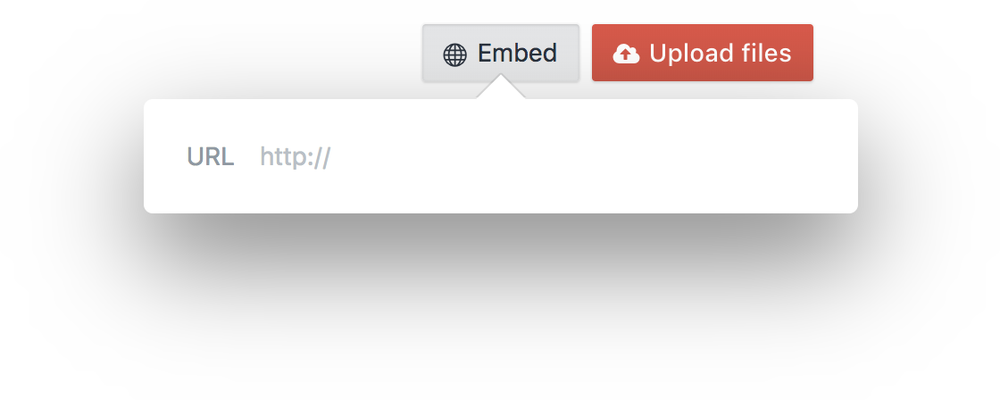
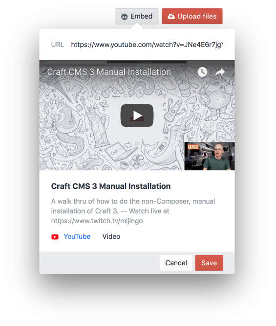
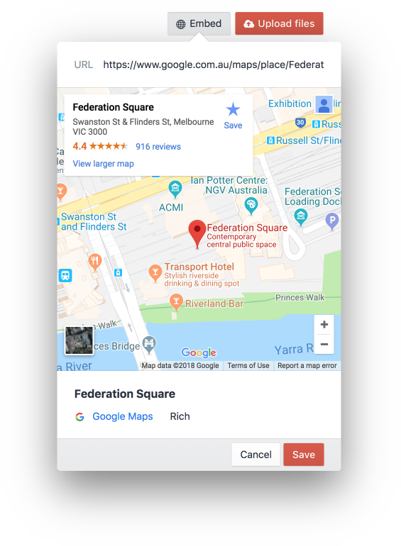
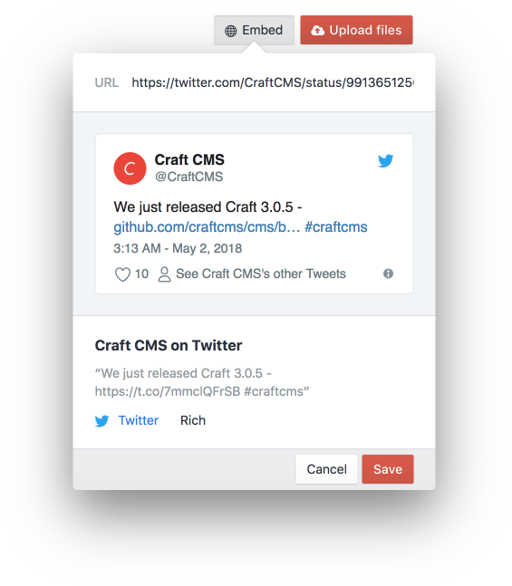
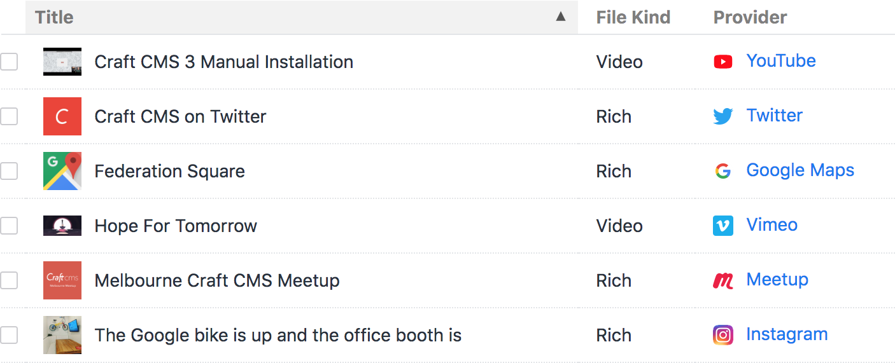

# Embedded Assets
#### Manage YouTube videos, Instagram photos, Twitter posts and more as first class assets

Embedded Assets is a [Craft CMS](https://craftcms.com) plugin that lets you add YouTube videos, Instagram photos, Twitter posts and more to Craft's asset manager, and treat them as first class assets. Just open up your asset manager, paste in a URL and watch the magic happen.

### Embed anything

Paste a URL to anything and Embedded Assets will pull all the images, embed codes and metadata it can from the page.

 

 

### Just an asset

Embedded assets are just JSON files. This means they can exist as real assets within your assets folders. With a little bit of Twig magic the embed information can be accessed and used in your templates.

 

 

## Documentation

- [Installation](docs/installation.md)
- [Templating](docs/templating.md)
- [GraphQL](docs/graphql.md)
- [Configuration](docs/configuration.md)
- [Events](docs/events.md)
- [Console Commands](docs/console-commands.md)
- [Changelog](CHANGELOG.md)

---

*Created by [Benjamin Fleming](https://github.com/benjamminf)*
 
*Maintained by [Spicy Web](https://spicyweb.com.au)*
